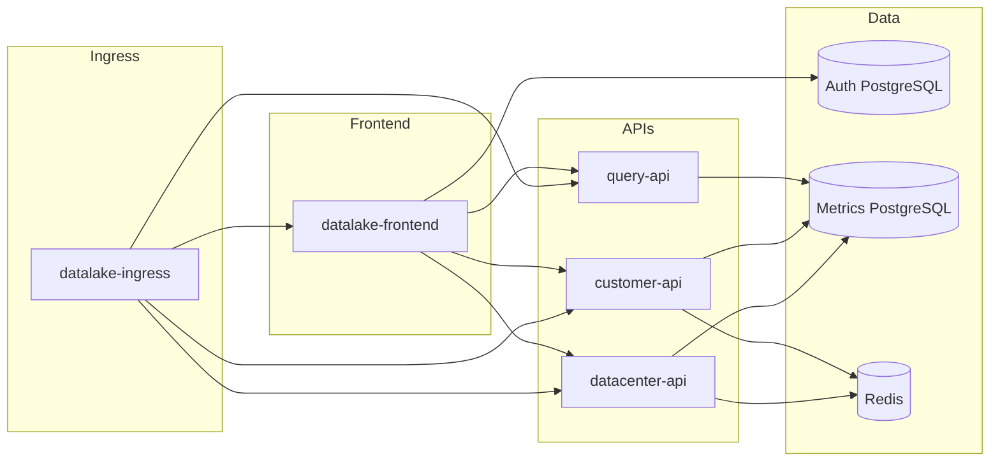

# Kubernetes deployment and rolling updates (full stack + auth)

This guide complements [KUBERNETES_SETUP.md](KUBERNETES_SETUP.md) with **authentication**, **rolling image updates**, and **Globe View / external map** considerations. For first-time cluster setup (mock-only vs full stack, apply order, API Secrets), start with [KUBERNETES_SETUP.md](KUBERNETES_SETUP.md) and return here for auth wiring and upgrades.

---

## 1. Scope

| Workload | Image build context | Container port | Service port (examples) |
|----------|---------------------|----------------|-------------------------|
| Dash frontend | Repository root [`Dockerfile`](../Dockerfile) | 8050 | 80 → 8050 |
| datacenter-api | [`services/datacenter-api`](../services/datacenter-api) | 8000 | 80 → 8000 |
| customer-api | [`services/customer-api`](../services/customer-api) | 8000 | 80 → 8000 |
| query-api | [`services/query-api`](../services/query-api) | 8000 | 80 → 8000 |
| Redis | `redis:7-alpine` (manifest) | 6379 | ClusterIP |

The Dash app uses **HTTPX** to call the three APIs. It also connects to a **dedicated PostgreSQL database for auth** (`AUTH_DB_*`), separate from the metrics/inventory DB used by the APIs (`DB_*`).

### 1.1 Mock stack (`k8s-mock/`)

For **`APP_MODE=mock`** demos, Path A runs the same Dash image with **in-cluster PostgreSQL** for auth/RBAC/Settings (StatefulSet `datalake-webui-mock-auth-db`), Secrets, and an initContainer that waits for `pg_isready`. This matches [`docker-compose.mock.yml`](../docker-compose.mock.yml). See [KUBERNETES_SETUP.md §3](KUBERNETES_SETUP.md) for file list and `kubectl apply` order. Rolling the UI: `kubectl set image deployment/datalake-webui-mock webui=<registry>/datalake-webui-mock:<tag>`; auth data persists on the StatefulSet PVC.

---

## 2. Architecture (with auth)



**Auth PostgreSQL** is not defined in `k8s/` sample manifests. Provision it outside the repo (managed RDS, Cloud SQL, a Postgres Helm chart, or a StatefulSet you maintain). Point `AUTH_DB_HOST` and related keys at that instance.

---

## 3. Prerequisites

- Kubernetes cluster and `kubectl` (see [KUBERNETES_SETUP.md §1](KUBERNETES_SETUP.md)).
- **Metrics DB**: reachable PostgreSQL for APIs; Secrets `DB_PASS` per API (see [KUBERNETES_SETUP.md §4.3](KUBERNETES_SETUP.md)).
- **Auth DB**: PostgreSQL instance with database/user for the auth schema (defaults in code: database `datalake_auth`, user configurable via `AUTH_DB_USER`).
- Ingress controller (NGINX example in [`k8s/ingress.yaml`](../k8s/ingress.yaml)).

---

## 4. Secrets

### 4.1 API database passwords

Unchanged from [KUBERNETES_SETUP.md §4.3](KUBERNETES_SETUP.md): create `datalake-*-api-secret` with key `DB_PASS` for each API.

### 4.2 Dash auth and JWT (`datalake-auth-secrets`)

Create a Secret with keys consumed by [`src/auth/config.py`](../src/auth/config.py) and JWT helpers:

| Key | Purpose |
|-----|---------|
| `SECRET_KEY` | Flask session signing |
| `AUTH_DB_PASS` | Password for `AUTH_DB_USER` |
| `FERNET_KEY` | Optional Fernet material for sensitive fields |
| `API_JWT_SECRET` | JWT for Dash → microservices when `API_AUTH_REQUIRED=true` on APIs; align with API env |

Reference template (do not commit real values): [`k8s/auth-secrets-reference.yaml`](../k8s/auth-secrets-reference.yaml).

Example:

```bash
kubectl create secret generic datalake-auth-secrets \
  --from-literal=SECRET_KEY='...' \
  --from-literal=AUTH_DB_PASS='...' \
  --from-literal=FERNET_KEY='...' \
  --from-literal=API_JWT_SECRET='...'
```

For GitOps, use Sealed Secrets, External Secrets, or your cloud secret store instead of plaintext in YAML.

---

## 5. ConfigMaps

### 5.1 API ConfigMaps

Edit per-service ConfigMaps for `DB_HOST`, `DB_PORT`, `DB_NAME`, `DB_USER`, Redis, and optional `API_JWT_SECRET` / `API_AUTH_REQUIRED` to match your security model. See [KUBERNETES_SETUP.md §4.4](KUBERNETES_SETUP.md).

### 5.2 Frontend ConfigMap (`datalake-frontend-config`)

[`k8s/frontend/configmap.yaml`](../k8s/frontend/configmap.yaml) must include:

- **API URLs**: `DATACENTER_API_URL`, `CUSTOMER_API_URL`, `QUERY_API_URL` (or a single `API_BASE_URL` if your client is configured that way). Use in-cluster DNS names on port 80, e.g. `http://datalake-datacenter-api`.
- **Auth DB (non-secret)**: `AUTH_DB_HOST`, `AUTH_DB_PORT`, `AUTH_DB_NAME`, `AUTH_DB_USER`.
- **Production**: set `AUTH_DISABLED` to `false` (or omit; default is auth enabled when unset).

Adjust hostnames for your auth PostgreSQL endpoint (FQDN or Service name if Postgres runs in-cluster).

---

## 6. Frontend Deployment: Secret wiring

[`k8s/frontend/deployment.yaml`](../k8s/frontend/deployment.yaml) uses:

- `envFrom` → `configMapRef` `datalake-frontend-config`
- `envFrom` → `secretRef` `datalake-auth-secrets`

Pods will not become Ready until the Secret exists and auth DB is reachable (migrations run at startup).

---

## 7. Recommended apply order

1. Namespace (if not using `default`).
2. **Redis** — [`k8s/redis/`](../k8s/redis/).
3. **Secrets** — API `DB_PASS` secrets + `datalake-auth-secrets`.
4. **API ConfigMaps** → **API Deployments/Services**.
5. **Frontend ConfigMap** → **Frontend Deployment/Service**.
6. **Ingress**.
7. Optional: HPA, monitoring ([KUBERNETES_SETUP.md §4.6–4.7, §5](KUBERNETES_SETUP.md)).

---

## 8. Rolling updates (existing deployment)

To ship a **new container image** without changing manifests:

```bash
# Replace <namespace>, registry, and tag
kubectl set image deployment/datalake-frontend \
  datalake-frontend=<your-registry>/datalake-frontend:<new-tag> \
  -n <namespace>

kubectl rollout status deployment/datalake-frontend -n <namespace>
```

Same pattern for APIs:

```bash
kubectl set image deployment/datalake-datacenter-api \
  datalake-datacenter-api=<your-registry>/datalake-datacenter-api:<new-tag> \
  -n <namespace>
kubectl rollout status deployment/datalake-datacenter-api -n <namespace>
```

Repeat for `datalake-customer-api` and `datalake-query-api`.

### 8.1 Rollback

```bash
kubectl rollout undo deployment/datalake-frontend -n <namespace>
kubectl rollout status deployment/datalake-frontend -n <namespace>
```

### 8.2 Config-only changes

After editing a ConfigMap or Secret:

```bash
kubectl apply -f k8s/frontend/configmap.yaml
kubectl rollout restart deployment/datalake-frontend -n <namespace>
```

### 8.3 Auth migrations

The Dash app runs auth DDL/migrations at startup (`run_migrations()` in `app.py`). For **multiple replicas**, ensure only one instance runs destructive migrations, or scale to one replica during upgrades, or run a dedicated Kubernetes Job for migrations—choose a strategy that matches your release process.

---

## 9. Globe View and external dependencies

The **Global View** page uses a custom Dash component with **MapLibre** (vector tiles from Carto CDN) and related assets. Worker nodes (or egress firewall) must allow **HTTPS outbound** to:

- Tile/style hosts used by the map (e.g. `basemaps.cartocdn.com`, `*.cartocdn.com` as required by the style URL in `dash_globe_component`).

If outbound traffic is restricted, allowlist these endpoints or host map assets inside the cluster and change the component configuration in a fork.

Session cookies (`dl_session` by default) should be sent over **HTTPS** in production; configure Ingress TLS ([KUBERNETES_SETUP.md §4.8](KUBERNETES_SETUP.md)).

---

## 10. Related documentation

| Document | Content |
|----------|---------|
| [KUBERNETES_SETUP.md](KUBERNETES_SETUP.md) | Full stack vs mock + auth DB (`k8s-mock/`), API secrets, apply order, Ingress |
| [TOPOLOGY_AND_SETUP.md](TOPOLOGY_AND_SETUP.md) | Topology, env vars, Compose |
| [AUTH_SYSTEM.md](AUTH_SYSTEM.md) | Auth stack overview and link to full reference |
| [env.example](../env.example) | Environment variables |

Upstream full auth reference (sibling repo): [`../Datalake-Platform-GUI/docs/AUTH_SYSTEM.md`](../Datalake-Platform-GUI/docs/AUTH_SYSTEM.md).
