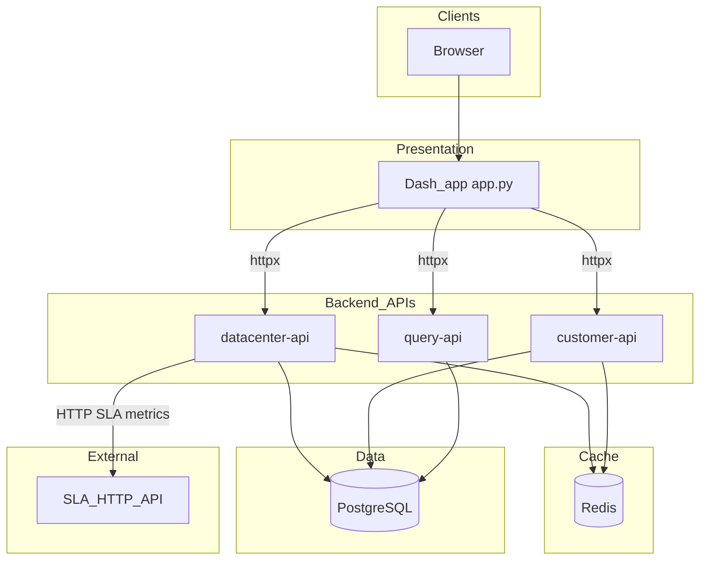

# Topology and Application Setup

This document describes the runtime topology of the Datalake Platform GUI, how components connect, and how to configure and start the application locally or in Kubernetes-oriented deployments.

For stopping/restarting the Dash UI and port **8050** issues, see [APP_RESTART.md](APP_RESTART.md).  
For coding and repository standards, see [PROJECT_STANDARDS.md](PROJECT_STANDARDS.md).

---

## 1. Architecture overview

The **Dash** frontend does not query the database directly. It uses **[`src/services/api_client.py`](../src/services/api_client.py)** (HTTPX) to call three **FastAPI** microservices. Those services connect to **PostgreSQL** (metrics and inventory). **Redis** is used for caching in the datacenter and customer APIs (graceful degradation if Redis is down). **SLA** availability data is fetched by the datacenter API from an **external HTTP API** and cached.



---

## 2. API responsibilities and main routes

Base path for HTTP APIs is **`/api/v1`** (unless noted). The Dash client may use one base URL for all services (see [Environment variables](#3-environment-variables)) or separate URLs per service.

| Domain | Service | Example paths |
|--------|---------|-----------------|
| Global dashboard, DC list, DC detail (incl. classic/hyperconv split), SLA, S3 pools, backup (NetBackup/Zerto/Veeam), cluster lists, filtered compute, physical inventory (DC + overview drill-down + customer device list) | **datacenter-api** | `/dashboard/overview`, `/datacenters/summary`, `/datacenters/{dc}`, `/sla`, `/datacenters/{dc}/s3/pools`, `/datacenters/{dc}/backup/*`, `/physical-inventory/*` |
| Customer list, customer resources, customer S3 vaults | **customer-api** | `/customers`, `/customers/{name}/resources`, `/customers/{name}/s3/vaults` |
| Dynamic SQL by registry key (Query Explorer) | **query-api** | `/queries/{query_key}` |

Health: datacenter-api exposes **`GET /health`** and **`GET /ready`** (used by Kubernetes-style probes; see [k8s/ingress.yaml](../k8s/ingress.yaml)).

---

## 3. Environment variables

### 3.1 Database (PostgreSQL)

Used by services and typically loaded from `.env` (see [`env.example`](../env.example)).

| Variable | Description |
|----------|-------------|
| `DB_HOST` | Database host |
| `DB_PORT` | Database port |
| `DB_NAME` | Database name (e.g. `bulutlake`) |
| `DB_USER` | Database user |
| `DB_PASS` | Database password |

Each microservice may use different default users in code; align `.env` with your deployment (e.g. `infra_svc` vs `customer_svc` in Docker/Kubernetes manifests).

### 3.2 Dash client — API base URLs

Set in the environment for the **Dash** process (see [`src/services/api_client.py`](../src/services/api_client.py)):

| Variable | Default | Description |
|----------|---------|-------------|
| `API_BASE_URL` | `http://localhost:8000` | Fallback when per-service URLs are not set |
| `DATACENTER_API_URL` | `API_BASE_URL` | Base URL for datacenter-api |
| `CUSTOMER_API_URL` | `API_BASE_URL` | Base URL for customer-api |
| `QUERY_API_URL` | `API_BASE_URL` | Base URL for query-api |

When all APIs are behind a single reverse proxy or ingress, a single `API_BASE_URL` matching that gateway is enough.

### 3.3 Datacenter API — Redis and cache

[`services/datacenter-api/app/config.py`](../services/datacenter-api/app/config.py) loads settings from `.env`. Relevant fields include:

| Setting (env) | Typical meaning |
|---------------|-----------------|
| `REDIS_HOST`, `REDIS_PORT`, `REDIS_DB`, `REDIS_PASSWORD` | Redis connection (see Pydantic `Settings` field names in `config.py`) |
| `CACHE_TTL_SECONDS`, `CACHE_MAX_MEMORY_ITEMS` | In-process cache tuning |

If Redis is unavailable, the service logs a warning and continues with memory-only caching where applicable.

### 3.4 Datacenter API — external SLA API

[`services/datacenter-api/app/services/sla_service.py`](../services/datacenter-api/app/services/sla_service.py):

| Variable | Description |
|----------|-------------|
| `SLA_API_URL` | HTTP endpoint for SLA datacenter metrics (default in code if unset) |
| `SLA_API_KEY` | API key sent as `X-API-Key` |

Override these in production; do not commit real secrets.

---

## 4. Prerequisites

- **Python**: Root [`Dockerfile`](../Dockerfile) uses **Python 3.10** for the Dash image; microservice images use **Python 3.11** (see `services/*/Dockerfile`). Local development: **Python 3.10+** is a reasonable target.
- **Dependencies**: Install from root [`requirements.txt`](../requirements.txt) for the Dash app. The app uses **HTTPX** in `api_client.py`; if `httpx` is not already pulled transitively, add `httpx` to your environment or to `requirements.txt`.
- **Backend services**: Each service has its own [`requirements.txt`](../services/datacenter-api/requirements.txt) under `services/<name>/` (FastAPI, uvicorn, psycopg2, redis, etc.).

---

## 5. Local setup and startup

### 5.1 Dash only (UI without live APIs)

Useful for layout work; API calls will fail or return empty placeholders unless backends are running and URLs are correct.

```bash
# From repository root
pip install -r requirements.txt
python app.py
```

- Default URL: **http://127.0.0.1:8050**
- The app runs with **`use_reloader=False`** so a single process listens on 8050 (see [APP_RESTART.md](APP_RESTART.md)).

### 5.2 Full stack (development)

Recommended order:

1. **PostgreSQL** reachable with credentials in `.env` (same variables services expect).
2. **Redis** (optional but recommended): e.g. `docker run` or Compose profile `microservice` — see [Docker Compose](#56-docker-compose).
3. **Backend APIs** (each in its own terminal, from the service directory, with `PYTHONPATH` including the app package):

   ```bash
   cd services/datacenter-api
   set PYTHONPATH=.   # Windows CMD; use $env:PYTHONPATH="." in PowerShell
   uvicorn app.main:app --host 0.0.0.0 --port 8000
   ```

   Repeat for **customer-api** and **query-api** on **different ports** (e.g. 8001, 8002) if not using a single gateway:

   ```bash
   uvicorn app.main:app --host 0.0.0.0 --port 8001
   ```

   Then set `DATACENTER_API_URL`, `CUSTOMER_API_URL`, and `QUERY_API_URL` accordingly for the Dash process.

4. **Dash**: `python app.py` with `API_BASE_URL` (or per-service URLs) pointing at the running APIs.

### 5.3 Docker images (microservices)

Each service builds from its directory:

| Service | Dockerfile | Default process |
|---------|------------|-----------------|
| datacenter-api | [`services/datacenter-api/Dockerfile`](../services/datacenter-api/Dockerfile) | `uvicorn app.main:app --host 0.0.0.0 --port 8000` |
| customer-api | [`services/customer-api/Dockerfile`](../services/customer-api/Dockerfile) | same |
| query-api | [`services/query-api/Dockerfile`](../services/query-api/Dockerfile) | same |

Build context must include the service `app/` tree and `requirements.txt` as in each Dockerfile.

### 5.4 Dash Docker image (root)

Root [`Dockerfile`](../Dockerfile) builds the Dash app and runs **Gunicorn** on port **8050**:

```text
gunicorn app:server --bind 0.0.0.0:8050 --workers 4 --timeout 120
```

### 5.5 Docker Compose

[`docker-compose.yml`](../docker-compose.yml) defines the Dash UI and optional infrastructure/APIs on a shared **`datalake`** network.

**PostgreSQL** is **not** started by the `microservice` profile. The three API services load **`DB_HOST`**, **`DB_PORT`**, **`DB_NAME`**, **`DB_USER`**, **`DB_PASS`** from **`env_file: .env`** (your external database). **Redis** still runs inside Compose for the `microservice` profile; **`REDIS_HOST=redis`** / **`REDIS_PORT=6379`** are set in Compose so containers resolve the Redis service name.

| Service | Profile | Ports (host) | Build / image |
|---------|---------|--------------|---------------|
| **`app`** | (always) | **8050** | Root [`Dockerfile`](../Dockerfile) |
| **`db`** | **`with-db` only** | **5432** | `postgres:15` (optional local Postgres for development) |
| **`redis`** | `microservice` | **6379** | `redis:7-alpine` |
| **`datacenter-api`** | `microservice` | **8000** | `./services/datacenter-api` |
| **`customer-api`** | `microservice` | **8001** | `./services/customer-api` |
| **`query-api`** | `microservice` | **8002** | `./services/query-api` |

**Full microservice stack** (external DB via `.env`, Redis, three APIs, Dash):

```bash
docker compose --profile microservice up -d --build
```

Or set **`COMPOSE_PROFILES=microservice`** in `.env` (see [`env.example`](../env.example)) so `docker compose up -d` starts the full stack.

The **`app`** service sets **`DATACENTER_API_URL`**, **`CUSTOMER_API_URL`**, and **`QUERY_API_URL`** to the Compose service names (`http://datacenter-api:8000`, etc.). Override via `.env` if needed.

**Dash only** (no APIs in Compose): `docker compose up -d app`. For API calls from the container to work, point the URLs in `.env` at reachable hosts (e.g. `host.docker.internal` if APIs run on the host).

**Database reachability from containers:** use your server IP/hostname in **`DB_HOST`**. If PostgreSQL runs on the **host** (not in Docker), use **`host.docker.internal`** (Docker Desktop on Windows/macOS) or the host’s LAN IP so API containers can connect.

**Optional local Postgres** (e.g. offline development): `docker compose --profile with-db up -d` starts **`db`**; then set **`DB_HOST=db`**, **`DB_PORT=5432`**, and matching **`DB_USER`** / **`DB_PASS`** in `.env` to match the `db` service in `docker-compose.yml`.

**Mock-only single container** (no profiles, no APIs): [`docker-compose.mock.yml`](../docker-compose.mock.yml) — `docker compose -f docker-compose.mock.yml up -d --build` → UI on **http://localhost:8050** with **`APP_MODE=mock`**. Override branding with **`APP_BRAND_TITLE`** in the shell or Compose environment.

---

## 6. Kubernetes (ingress routing)

For a **step-by-step** install (images, Secrets, ConfigMaps, apply order, verification), see **[KUBERNETES_SETUP.md](KUBERNETES_SETUP.md)**.

[`k8s/ingress.yaml`](../k8s/ingress.yaml) (example host `bulutistan.local`) routes:

| Path prefix | Backend Service (example name) |
|-------------|--------------------------------|
| `/api/v1/sla`, `/api/v1/physical-inventory`, `/api/v1/datacenters`, `/api/v1/dashboard`, `/health` | `bulutistan-datacenter-api` |
| `/api/v1/customers` | `bulutistan-customer-api` |
| `/api/v1/queries` | `bulutistan-query-api` |
| `/` | `bulutistan-frontend` |

Adjust hostnames and service names to match your cluster. Do not store secrets in this file.

### 6.1 Mock-only stack (`k8s-mock/`)

For customer demos with **static mock data only** (no PostgreSQL, Redis, or microservices), use [`k8s-mock/`](../k8s-mock/): a single Deployment with **`APP_MODE=mock`**, plus Service and optional Ingress.

1. Build the root [`Dockerfile`](../Dockerfile) and tag it as **`datalake-webui-mock:latest`** (or change the image in [`k8s-mock/deployment.yaml`](../k8s-mock/deployment.yaml)).
2. Load the image into your cluster if needed (kind, minikube, etc.).
3. Apply manifests in order:

```bash
kubectl apply -f k8s-mock/configmap.yaml
kubectl apply -f k8s-mock/deployment.yaml
kubectl apply -f k8s-mock/service.yaml
kubectl apply -f k8s-mock/ingress.yaml
```

The Ingress example uses host **`datalake-demo.local`**; point it at your ingress controller IP via `/etc/hosts` or DNS. Edit [`k8s-mock/configmap.yaml`](../k8s-mock/configmap.yaml) **`APP_BRAND_TITLE`** to customize the sidebar and browser tab per demo.

---

## 7. Related documentation

| Document | Content |
|----------|---------|
| [KUBERNETES_SETUP.md](KUBERNETES_SETUP.md) | Kubernetes: mock stack, full stack, monitoring, troubleshooting |
| [APP_RESTART.md](APP_RESTART.md) | Stopping Dash, port 8050, `stop_app.ps1` |
| [PROJECT_STANDARDS.md](PROJECT_STANDARDS.md) | Project standards |
| [CACHE_STRATEGY_COMPARISON.md](CACHE_STRATEGY_COMPARISON.md) | Legacy vs Redis cache, warm/refresh pillars |
| [env.example](../env.example) | Example `.env` for database |

---

## 8. Legacy and tests

- **`legacy/`**: Archived monolith-style backend and tests; active APIs are under **`services/`**.
- **Tests**: Root [`tests/`](../tests/) targets the Dash app and shared helpers; each service has its own `tests/` under `services/<name>/`.
